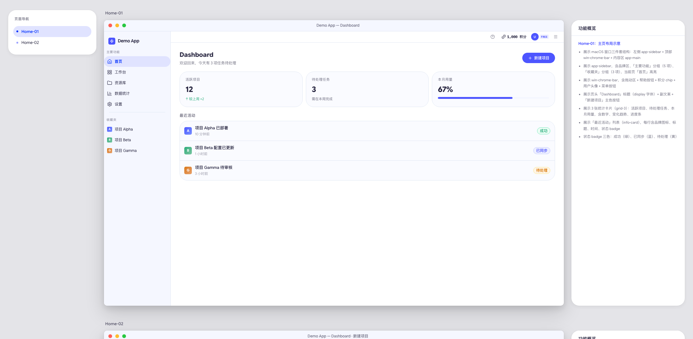

# Prototype

把已有 PRD Markdown 转成可直接评审的高保真 HTML 原型。

它不是根据一句想法自由发挥的 UI 生成器。PRD 是唯一业务事实来源；Skill 负责把已确认的页面、状态、流程和边界转译成原型，不擅自补造规则。



## 核心能力

- 左侧页面索引、中间产品原型、右侧功能说明一一对应
- 从 PRD 提取主流程、页面状态、异常和权限边界
- PRD 说明与原型组件双向高亮
- 浏览器内编辑文案，刷新后保留，并可导出自包含评审版
- 统一主题与组件资产，支持替换 tweakcn 主题
- 真实浏览器验收文案覆盖、持久化和只读区域

当前只覆盖 PC / macOS 风格的桌面端产品原型，不支持移动端。

## 前置条件

- Node.js 22+
- Google Chrome 或 Chromium
- 一份已有的 PRD Markdown 文件

安装后可运行环境检查：

```bash
./scripts/check-env.mjs
```

## 安装

Claude Code：

```bash
git clone https://github.com/monsignorlaw1015/Prototype.git ~/.claude/skills/high-fidelity-prototype
```

其他支持 Skill 的 Agent，请将仓库 clone 到对应的 skills 目录。Skill 内部会从 `SKILL.md` 所在目录解析脚本，不依赖固定安装位置。

作者的其他项目：[monsignorlaw1015](https://github.com/monsignorlaw1015?tab=repositories)

## 使用

先准备 PRD，例如 `docs/member-center-prd.md`，然后在 Agent 中调用：

```text
使用 $high-fidelity-prototype，把 docs/member-center-prd.md
生成成可评审原型，输出到 prototypes/member-center.html。
```

如果没有提供 PRD，Skill 会停止生成并要求先提供 PRD，不会根据一句构思补造业务规则。

## 交付结构

每个页面状态对应一组原型和功能说明：

```text
页面索引 | 1460 × 910 产品原型 | 功能概览
```

最终输出为自包含 HTML 文件，可直接双击打开。主题、组件样式、高亮和文案编辑运行时由脚本注入，无需随交付文件附带额外 CSS 或 JavaScript。

## 维护与验证

将本仓库目录保存为 `SKILL_DIR` 后执行：

```bash
"$SKILL_DIR/assets/inject-assets.mjs" prototypes/example.html
"$SKILL_DIR/scripts/validate-editor.mjs" prototypes/example.html
```

检查仓库自带示例：

```bash
./assets/inject-assets.mjs ./assets/example.html
./scripts/validate-editor.mjs ./assets/example.html
```

浏览器打开 [`assets/components.html`](assets/components.html) 可查看组件及 token。详细结构和业务转译规则位于 [`references/`](references/)。

## 更换主题

```bash
./assets/extract-theme.sh https://tweakcn.com/themes/<theme-id>
```

脚本会更新 `assets/theme.css`。tweakcn 不提供 sidebar 子 token 和业务状态色，切换后需按 [`references/default-theme.md`](references/default-theme.md) 补齐并重新注入原型。

## 目录

```text
Prototype/
├── SKILL.md
├── agents/openai.yaml
├── assets/
├── references/
├── scripts/
└── evals/evals.json
```

`assets/projects/` 用于作者本机的私有项目母版，已加入 `.gitignore`，不属于公开仓库。

## License

[MIT](LICENSE)
